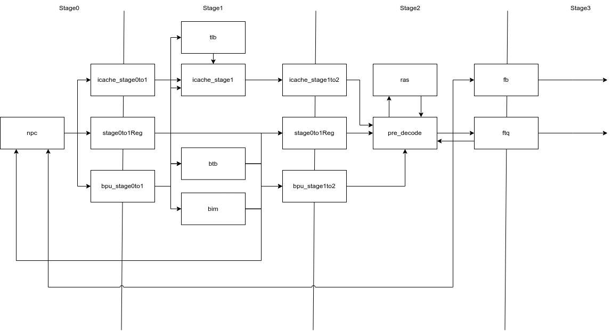
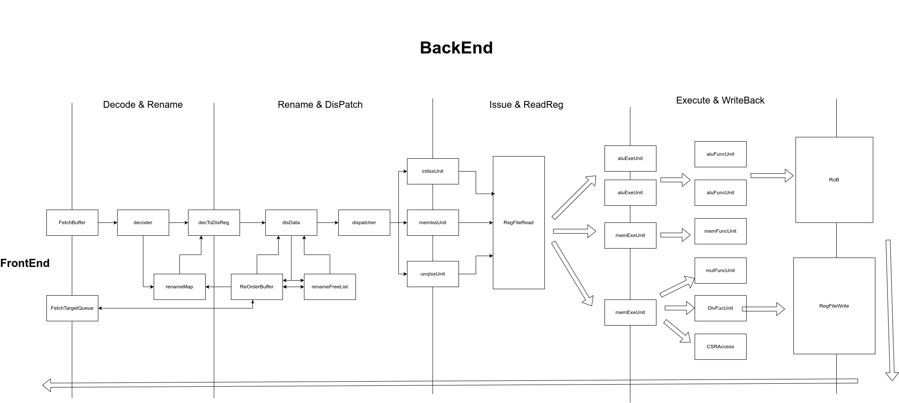

<div style="text-align: center; page-break-after: always;">
    <h1 style="font-size: 32pt; color: #2c5282; margin-top: 100pt;">KXCore</h1>
    <h2 style="font-size: 20pt; color: #4a90a4; margin-top: 30pt;">设计文档</h2>
    <div style="margin-top: 80pt; font-size: 14pt;">
        <p><strong>参赛队员：</strong></p>
        <p>张逸轩、刘镇睿、丁宏阳 谷虚怀</p>
        <p><strong>学校：</strong></p>
        <p>杭州电子科技大学</p>
    </div>

# 目录

- [一、概述](#一概述)
- [二、流水线架构](#二流水线架构)
  - [2.1 顶层模块层次](#21-顶层模块层次)
  - [2.2 前端设计](#22-前端设计)
  - [2.3 后端设计](#23-后端设计)
- [三、关键优化设计](#三关键优化设计)
  - [3.1 乱序执行核心机制](#31-乱序执行核心机制)
  - [3.2 分支预测机制](#32-分支预测机制)
  - [3.3 缓存系统](#33-缓存系统)
  - [3.4 虚拟内存管理系统](#34-虚拟内存管理系统)
  - [3.5 高性能算术运算单元](#35-高性能算术运算单元)
  - [3.6 高级系统特性](#36-高级系统特性)
- [四、技术创新与亮点](#四技术创新与亮点)
  - [4.1 先进的微架构设计](#41-先进的微架构设计)
  - [4.2 先进的分支预测](#42-先进的分支预测)
  - [4.3 指令吞吐量优化](#43-指令吞吐量优化)
  - [4.4 延迟优化策略](#44-延迟优化策略)
- [五、项目说明](#五项目说明)
  - [5.1 项目结构](#51-项目结构)
  - [5.2 构建流程](#52-构建流程)
  - [5.3 配置参数](#53-配置参数)

<div style="page-break-after: always;"></div>


## 一、概述

KXCore 是一个基于 la32r 指令集的乱序多发射 CPU, 支持4发射，双提交同时具有分支预测，Cache等优化设计。

我们实现了 LoongArch32 精简版，支持：
- **基础指令集**：包含算术运算、逻辑运算、移位、分支跳转等指令
- **访存指令**：支持字节、半字、字的加载存储操作
- **系统指令**：ERTN、SYSCALL、EBREAK等特权指令
- **CSR操作**：CSRRD、CSRWR、CSRXCHG等控制状态寄存器指令
- **中断异常处理**：完整的异常处理机制和中断控制
- **AXI总线接口**：支持标准AXI3总线协议

### 核心参数
- **数据位宽**：32位
- **取指宽度**：四路取指 (fetchWidth = 4)
- **译码宽度**：2路译码 (coreWidth = 2)
- **发射宽度**：3个发射队列，总计4个执行单元
  - MEM IQ: 发射宽度1，队列深度16
  - UNQ IQ: 发射宽度1，队列深度16  
  - INT IQ: 发射宽度2，队列深度24
  // TODO
- **退休宽度**：2路退休 (retireWidth = 2)
- **物理寄存器**：80个物理寄存器，32个逻辑寄存器
- **ROB大小**：32个条目的重排序缓冲区
- **取指缓冲区**：32个条目 (fbNum = 32)
- **取指目标队列**：32个条目 (ftqNum = 32)
- **返回地址栈**：32个条目 (rasNum = 32)

## 二、流水线架构

KXCore 使用了前后端10级流水线架构，其中前端为4级流水线，后端为6级流水线。

### 2.1 顶层模块层次
```
Core (核心处理器)
├── TLB (地址转换缓冲区)
├── CSR (控制状态寄存器)
├── FrontEnd (前端)
│   ├── ICache (指令缓存)
│   ├── BranchPredictor (分支预测器)
│   │   ├── BIM (分支指令缓冲区)
│   │   ├── BTB (分支目标缓冲区)
│   │   └── RAS (返回地址栈)
│   ├── FetchBuffer (取指缓冲区)
│   └── FTQ (取指目标队列)
└── BackEnd (后端)
    ├── Decoder (译码器)
    ├── RenameMapTable (重命名映射表)
    ├── RenameFreeList (重命名空闲列表)
    ├── RenameBusyTable (重命名忙表)
    ├── BasicDispatcher (基本分派器)
    ├── IssueUnits (发射单元) × 3
    │   ├── MemIssueUnit (内存发射单元)
    │   ├── UnqIssueUnit (特殊发射单元)
    │   └── IntIssueUnit (整数发射单元)
    ├── ExecutionUnits (执行单元) × 4
    │   ├── MemExeUnit (内存执行单元)
    │   ├── UniqueExeUnit (特殊执行单元)
    │   └── ALUExeUnit (ALU执行单元) × 2
    ├── FullyPortedRF (全端口寄存器文件)
    └── ReorderBuffer (重排序缓冲区)
```

### 2.2 前端设计



前端采用4级流水线设计，包含以下阶段：

#### Stage 0: 预取指阶段

- **PC生成**：顺序取指或者根据后端和多级分支预测期进行PC重定向选择。

#### Stage 1: 分支预测与取指阶段

##### 指令缓存 (ICache)
   
ICache是高性能指令获取的关键组件，采用3级流水线设计。我们的缓存支持灵活的参数配置，设置容量、相联度和块大小，用于性能调优。同时采用物理标记虚拟索引(PIPT)设计，避免别名问题。同时集成TLB访问，完整支持虚拟内存管理。支持CACOP指令做精确的缓存控制操作(缓存初始化、无效化、写回操作)和特权级访问控制。

##### 分支预测器系统器 (BranchPredictor)
   
我们实现了先进的混合分支预测器架构，包含了分支指令缓冲区(BIM)、分支目标缓冲区(BTB)和目标地址计算三个核心组件。
   
**分支指令缓冲区(BIM)** 

BIM拥有2048组的分支历史表，每个条目采用2位饱和计数器，使用了经典的2位饱和计数器预测分支方向算法，基于取指PC的低位进行组索引，同时支持每周期4条指令的并行预测。

```scala
// 2位饱和计数器更新逻辑
def bimWrite(v: UInt, taken: Bool): UInt = {
  val old_bim_sat_taken  = v === 3.U
  val old_bim_sat_ntaken = v === 0.U
  Mux(old_bim_sat_taken && taken, 3.U, 
    Mux(old_bim_sat_ntaken && !taken, 0.U, 
    Mux(taken, v + 1.U, v - 1.U)))
}
```
   
**分支目标缓冲区 (BTB)**：
BTB采用了128组2路组相联结构来优化存储效率，目标地址计算支持相对偏移和绝对地址。使用LRU算法做缓存替换。使用EBTB专门处理长距离跳转的目标地址存储。

- **标签匹配**

```scala
val hitOHs = VecInit((0 until fetchWidth).map { i =>
  VecInit((0 until nWays).map { w =>
    io.req.bits.meta(w)(i).tag === tag
})
})
```

- **目标地址计算**
```scala
io.resp.bits.pred(i).target.bits := Mux(
  btb.extended,
  io.req.bits.ebtb,  // 扩展BTB用于长距离跳转
  params.fetchAlign(io.req.bits.fetchPC) + (i << log2Ceil(instBytes)).U +
  Sext(btb.offset, instWidth),  // 相对偏移计算
)
```

**预测融合与结果生成**

BIM和BTB相互配合，BIM提供方向预测，BTB提供目标和类型信息。如条件分支(`isBr`)需要方向预测，无条件跳转 (`isJmp`)直接跳转，间接跳转结合BTB的目标预测。

```scala
io.resp.bits.pred zip bim.io.resp.bits.pred zip btb.io.resp.bits.pred foreach { 
  case ((resp, bim), btb) =>
    resp := btb                    // 基础信息来自BTB
    resp.taken := bim.taken        // 方向预测来自BIM
}
```

**并行处理与同步机制**
   
我们采用了双通道并行处理架构。
   
- **双通道设计**：
```scala
// ICache和BPU并行处理
icacheStage1.io.req.valid := pipeStage0to1.io.out.valid && 
                             icacheStage0to1.io.resp.valid
bpuStage1.io.req.valid := pipeStage0to1.io.out.valid && 
                          bpuStage0to1.io.resp.valid
```
   
- **数据流同步**：
     ```scala
     // 从Stage 0获取预处理数据
     bpuStage1.io.req.bits.bim := bpuStage0to1.io.resp.bits.bim
     bpuStage1.io.req.bits.btb.meta := bpuStage0to1.io.resp.bits.btb.meta
     ```
   
   - **握手协议**：确保两个通道的结果同步
```scala
val s1_fire = pipeStage0to1.io.out.valid && 
              icacheStage0to1.io.resp.valid && 
              bpuStage0to1.io.resp.valid &&
              icacheStage1to2.io.req.ready && 
              pipeStage1to2.io.in.ready
```

**即时重定向机制**
   
我们在Stage 1内部实现了快速的PC重定向，同时优先处理第一个预测跳转的指令
   
- **重定向条件检测**：
```scala
val s1_redirects = (0 until fetchWidth).map { i =>
  s1_fetchMask(i) && s1_bpuResp.pred(i).target.valid &&
  (s1_bpuResp.pred(i).isJmp ||
  (s1_bpuResp.pred(i).isBr && s1_bpuResp.pred(i).taken))
}
```
   
- **重定向目标选择**：
```scala
stage1Redirect.bits := Mux(
  s1_redirects.reduce(_ || _),
  s1_bpuResp.pred(PriorityEncoder(s1_redirects)).target.bits,
  nextFetch(s1_fetchPC),  // 顺序取指
)
```

#### Stage 2: 预解码阶段 

预解码阶段是我们 KXCore 前端设计的核心优化阶段，通过提前识别和处理控制流指令，可以显著提高分支预测精度和取指效率。

##### 控制流指令识别与分类

KXCore在预解码阶段实现了完整的控制流指令识别系统，识别分支指令(`isBr`)、跳转指令(`isB`)、间接跳转(`isJIRL`)、特殊指令(`isIDLE`)

##### 函数调用、返回识别和返回地址栈(RAS)管理

通过识别函数调用和返回模式，使用RAS专门优化函数调用和返回预测，提高分支预测准确率。RAS 具有32个条目的深度栈，支持深度嵌套函数调用，函数调用时自动压入返回地址，返回时自动弹出预测地址，自动维护栈顶指针，支持栈回滚恢复。
   
- 函数调用识别(`isCall`)
```scala
// BL指令直接调用
(inst === BL.inst) || 
// JIRL r1, rj, 0 形式的调用
(inst === JIRL.inst && inst(4,0) === 1.U && inst(25,10) === 0.U)
```
   
- 函数返回识别 (`isRet`)
```scala
// JIRL r0, r1, 0 标准返回模式
inst === JIRL.inst && inst(4,0) === 0.U && 
inst(9,5) === 1.U && inst(25,10) === 0.U
```

- 检测到函数调用时，压入下一条指令地址

```scala
ras.io.write.valid := s2_fire && !s2_exception.valid && 
                      s2_fetchBundle.cfiIdx.valid && s2_callMask(s2_cfiIdx)
ras.io.write.addr := s2_pcs(s2_cfiIdx +& 1.U)
```

##### 控制流指令优先级处理
   
预解码阶段实现了智能的控制流指令选择机制，在取指宽度内检测第一个控制流指令，控制流指令后的指令被自动屏蔽，避免错误执行，根据控制流类型计算新的取指目标。
   
```scala
val s2_cfiMask = PriorityEncoderOH(VecInit((0 until fetchWidth).map { i =>
  s2_fetchMask(i) && (s2_jmpMask(i) || (s2_brMask(i) && s2_bpuResp.pred(i).taken))
}).asUInt)
```

##### 分支预测结果验证
   
预解码阶段对Stage 1的分支预测结果进行验证和修正，包括验证条件分支的taken/not-taken预测，验证跳转目标地址的正确性，并在发现预测错误时立即触发重定向

#### Stage 3: 发送指令阶段

发送指令阶段是前端流水线的最后一个阶段，主要负责缓冲前端处理结果并向后端提供稳定的指令流。该阶段包含两个关键组件：取指缓冲区(FetchBuffer)和取指目标队列(FTQ)。

##### 取指缓冲区 (FetchBuffer)

取指缓冲区是连接前端和后端的关键缓冲结构，将前端的取指包转换为后端可以处理的微操作序列。缓冲区总共32个条目，按行组织存储结构，每行包含2个条目(coreWidth=2)，共16行，支持高效的并行访问，采用一热编码的头尾指针，简化指针管理和冲突检测。

**入队操作机制**
取指缓冲区接收来自Stage 2的完整取指包，并转换为微操作格式。

- **取指包解析**：将FetchBundle中的4条指令逐一转换为MicroOp格式
```scala
for (i <- 0 until fetchWidth) {
  val pc = io.enq.bits.pcs(i)
  in_uops(i).pcLow := pc(log2Ceil(fetchBytes) - 1, 0)
  in_uops(i).inst  := io.enq.bits.insts(i)
  in_uops(i).ftqIdx := io.enq.bits.ftqIdx
  in_uops(i).isBr   := io.enq.bits.brMask(i)
  in_uops(i).isB    := io.enq.bits.bMask(i)
  in_uops(i).isJirl := io.enq.bits.jirlMask(i)
}
```

- **动态写入索引生成**：使用循环递增的方式为每条有效指令分配存储位置
```scala
var enq_idx = tail
for (i <- 0 until fetchWidth) {
  enq_idxs(i) := enq_idx
  enq_idx = Mux(in_mask(i), inc(enq_idx), enq_idx)
}
```

- **冲突检测机制**：检测写入操作是否会与读取头指针冲突
```scala
val do_enq = !(atHead && maybeFull || mightHitHead)
```

**出队操作机制**
缓冲区每周期向后端提供最多2条微操作(coreWidth=2)。

- **行级读取**：一次读取一整行数据，提供2个微操作给后端译码器
- **冲突避免**：检测读取操作是否会与写入尾指针冲突
```scala
val tail_collisions = VecInit((0 until fbNum).map(i => 
  head(i / coreWidth) && (!maybeFull || (i % coreWidth != 0).B))).asUInt & tail
val do_deq = io.deq.ready && !will_hit_tail
```

- **有效性管理**：为每个输出的微操作提供有效性标记，支持变长输出

**流水线刷新处理**
当收到流水线刷新信号时，立即清空所有缓冲区内容，将头尾指针重置为初始状态，为新的指令流做准备
```scala
when(io.flush) {
  head      := 1.U
  tail      := 1.U
  maybeFull := false.B
}
```

##### 取指目标队列 (FTQ)

取指目标队列 FTQ 是用于保存从 ICache 接收到的指令代码以及与该地址相关的分支预测信息, 用来供流水线在 微操作阶段执行作参考。

**队列管理架构**
32个条目的环形队列，支持高吞吐量的取指操作，每个FTQ条目包含完整的取指和分支预测信息：

```scala
class FTQBundle extends Bundle {
  val fetchPC   = UInt(vaddrWidth.W)      // 取指PC地址
  val rasIdx    = UInt(log2Ceil(rasNum).W) // RAS栈指针
  val brMask    = UInt(fetchWidth.W)       // 分支指令掩码
  val cfiIdx    = Valid(UInt(log2Ceil(fetchWidth).W)) // 控制流指令索引
  val cfiIsB    = Bool()                   // 是否为无条件跳转
  val cfiIsBr   = Bool()                   // 是否为条件分支
  val cfiIsJirl = Bool()                   // 是否为间接跳转
  val meta      = new BranchPredictionMeta // 分支预测元数据
}
```

**入队操作处理**
FTQ与FetchBuffer同步入队，记录每次取指操作的完整信息：

```scala
when(do_enq) {
  val new_entry = Wire(new FTQBundle)
  new_entry.fetchPC      := io.enq.bits.pc
  new_entry.rasIdx       := io.enq.bits.rasIdx
  new_entry.brMask       := io.enq.bits.brMask
  new_entry.cfiIdx       := io.enq.bits.cfiIdx
  // 根据CFI类型设置控制流标记
  new_entry.cfiIsB       := io.enq.bits.bMask(io.enq.bits.cfiIdx.bits)
  new_entry.cfiIsBr      := io.enq.bits.brMask(io.enq.bits.cfiIdx.bits)
  new_entry.cfiIsJirl    := io.enq.bits.jirlMask(io.enq.bits.cfiIdx.bits)
}
```

**分支预测更新支持**
FTQ提供分支预测器的延迟更新机制，确保预测准确性，当bpu_ptr追上deq_ptr时，触发分支预测更新，使用下一个条目的fetchPC作为当前分支的目标地址

```scala
when(bpu_ptr =/= deq_ptr) {
  bpu_ptr := WrapInc(bpu_ptr, ftqNum)
  val bpuEntry = ram(bpu_ptr)
  val target   = ram(WrapInc(bpu_ptr, ftqNum)).fetchPC
  
  io.bpuUpdate.valid   := bpuEntry.cfiIdx.valid || bpuEntry.brMask =/= 0.U
  io.bpuUpdate.fetchPC := bpuEntry.fetchPC
  io.bpuUpdate.target  := target
}
```

**重定向和恢复机制**
FTQ支持分支预测错误和异常的快速恢复，当后端发生重定向时，回滚FTQ到正确的状态，同时提供RAS指针的恢复信息，确保函数调用栈的正确性。

```scala
when(io.redirect.valid) {
  enq_ptr    := WrapInc(io.redirect.idx, ftqNum)
  maybe_full := false.B
  
  // 如果有分支恢复信息，更新CFI状态
  when(io.redirect.brRecovery.valid) {
    redirect_new_entry.cfiIdx    := io.redirect.brRecovery.cfiIdx
    redirect_new_entry.cfiIsB    := io.redirect.brRecovery.cfiIsB
    redirect_new_entry.cfiIsBr   := io.redirect.brRecovery.cfiIsBr
    redirect_new_entry.cfiIsJirl := io.redirect.brRecovery.cfiIsJirl
  }
}
```

**后端接口支持**
FTQ为后端执行单元提供PC查询接口，支持3个并发的PC查询请求，满足多个执行单元的需求，为正在入队的条目提供实时的PC信息
```scala
for (i <- 0 until 3) {
  val idx = io.reqs(i)
  io.resps(i).valid := idx =/= enq_ptr || io.enq.fire
  io.resps(i).entry := ram(idx)
  when(idx === enq_ptr) {
    io.resps(i).entry.fetchPC := io.enq.bits.pc  // 实时数据
  }
}
```

### 2.3 后端设计



#### Stage 0: 译码与重命名1阶段

译码与重命名1阶段是后端流水线的起始阶段，承担着将前端取指结果转换为后端可执行微操作的核心任务。重命名设计通过将架构寄存器映射到物理寄存器的虚拟设计，用来打破数据输出依赖和反依赖关系，从而解决写后写和写后读数据冒险。

##### 指令译码系统

**主要模块**：[`Decoder`](../superscalar/src/KXCore/superscalar/core/backend/Decode/Decoder.scala)

KXCore的指令译码器采用了基于Chisel `DecodeField`的高效译码架构，能够在单周期内完成复杂的LoongArch32指令解析。译码器通过多个并行的控制字段生成器，同时提取指令的各种属性信息，避免了传统译码器的串行瓶颈。

**发射队列类型分配** (`IQTypeControlField`)

译码器首先根据指令特性将其分配到三个专用发射队列之一。这种分类策略充分考虑了指令的执行特性和资源需求，实现了高效的并行处理：

- **内存发射队列 (IQT_MEM)**：承担所有访存相关指令的调度任务
  - 加载指令：`LD_B`、`LD_H`、`LD_W`、`LD_BU`、`LD_HU`支持不同数据宽度的内存读取
  - 存储指令：`ST_B`、`ST_H`、`ST_W`支持精确的内存写入操作
  - 原子指令：`LL_W`、`SC_W`提供原子性内存访问保证
  - 内存屏障：`DBAR`、`IBAR`确保内存操作的顺序性

- **特殊发射队列 (IQT_UNQ)**：处理需要特殊资源或顺序执行的指令
  - 乘除法指令：`MUL_W`、`MULH_W`、`MULH_WU`、`DIV_W`、`MOD_W`、`DIV_WU`、`MOD_WU`
  - CSR操作：`CSRRD`、`CSRWR`、`CSRXCHG`系列指令管理控制状态寄存器
  - 系统指令：`BREAK`、`SYSCALL`、`ERTN`处理异常和系统调用
  - TLB管理：`TLBSRCH`、`TLBRD`、`TLBWR`、`TLBFILL`、`INVTLB`
  - 计数器访问：`RDCNTID_W`、`RDCNTVH_W`、`RDCNTVL_W`
  - 缓存操作：`CACOP`、`CPUCFG`

- **整数发射队列 (IQT_INT)**：承担高频的整数运算指令,为双发射
  - 算术运算：`ADD_W`、`SUB_W`、`ADDI_W`等基础算术操作
  - 逻辑运算：`AND`、`OR`、`XOR`、`NOR`等位操作
  - 比较指令：`SLT`、`SLTU`、`SLTI`、`SLTUI`
  - 移位运算：`SLL_W`、`SRL_W`、`SRA_W`及其立即数版本
  - 分支指令：`BEQ`、`BNE`、`BLT`、`BGE`、`BLTU`、`BGEU`
  - 跳转指令：`B`、`BL`、`JIRL`

**功能单元类型识别** (`FUTypeControlField`)

在确定发射队列的同时，译码器还可以识别指令所需的功能单元类型，确保指令能够被正确的执行单元处理：

- **ALU功能单元** (`FUT_ALU`)：处理基础的算术逻辑运算
- **内存功能单元** (`FUT_MEM`)：处理所有内存访问操作
- **乘法功能单元** (`FUT_MUL`)：专门处理乘法运算
- **除法功能单元** (`FUT_DIV`)：专门处理除法和取模运算
- **控制流功能单元** (`FUT_CFI`)：处理分支跳转指令
- **CSR功能单元** (`FUT_CSR`)：处理系统级操作

**操作数类型解析**

译码器通过操作数分析，为每条指令确定数据来源和目标：

- **第一操作数选择** (`OP1SelControlField`)：
  - `OP1_RS1`：使用源寄存器1的值
  - `OP1_PC`：使用程序计数器的值（用于PC相对寻址）

- **第二操作数选择** (`OP2SelControlField`)：
  - `OP2_RS2`：使用源寄存器2的值
  - `OP2_IMM`：使用指令中的立即数
  - `OP2_NEXT`：使用下一条指令地址（用于链接跳转）

**立即数类型识别** (`IMMTypeControlField`)

译码器根据指令格式自动识别立即数的类型和长度：
- `IMM_5U`：5位无符号立即数（移位量）
- `IMM_12`：12位有符号立即数（算术运算）
- `IMM_12U`：12位无符号立即数（逻辑运算）
- `IMM_14`：14位立即数（链式载存）
- `IMM_16`：16位立即数（分支偏移）
- `IMM_20`：20位立即数（高位立即数）
- `IMM_26`：26位立即数（长跳转）

**源寄存器有效性检测**

译码器读取每条指令的寄存器使用模式，避免不必要的寄存器读取：

- **RS1控制** (`RS1ControlField`)：识别是否需要读取源寄存器1
- **RS2控制** (`RS2ControlField`)：识别是否需要读取源寄存器2，同时区分从Rk或Rd字段读取

**目标寄存器写回控制** (`WBControlField`)

译码器确定指令的写回目标，支持多种写回模式：
- `destRd`：写回到Rd寄存器（大多数指令）
- `destR1`：写回到R1寄存器（链接跳转BL）
- `destRj`：写回到Rj寄存器（RDCNTID指令）
- `destNone`：不写回任何寄存器（存储、分支等）

**特殊指令属性标记**

译码器还为指令附加重要的执行属性：
- **唯一性标记** (`UniqControlField`)：标识需要顺序执行的指令
- **提交刷新标记** (`CommitFlushControlField`)：标识提交时需要刷新流水线的指令
- **忙表标记** (`BusyControlField`)：标识是否需要在忙表中跟踪

##### 寄存器重命名系统

寄存器重命名是 KXCore 实现乱序执行的核心机制，通过将逻辑寄存器动态映射到物理寄存器，消除了指令间的假依赖关系，大幅提升了指令级并行度。

**重命名映射表** (`RenameMapTable`)

重命名映射表维护着逻辑寄存器到物理寄存器的动态映射关系。我们设计了双映射表，分别用来维护推测状态和提交状态：

- **推测映射表** (`renMapTable`)：反映当前推测执行状态下的寄存器映射
- **提交映射表** (`comMapTable`)：反映已提交指令的确定寄存器映射

这种设计在分支预测错误或异常发生时，能够快速恢复到正确的寄存器状态。映射表支持每周期2条指令的并行重命名，通过内部旁路机制解决同周期内的依赖关系：

```scala
// 内部旁路逻辑：如果前面的指令正在重命名同一个逻辑寄存器
io.mapResps(i).prs1 := (0 until coreWidth).foldLeft(renMapTable(io.mapReqs(i).lrs1))((p, k) =>
  Mux(bypass.B && io.renRemapReqs(k).valid && io.renRemapReqs(k).ldst === io.mapReqs(i).lrs1, 
      io.renRemapReqs(k).pdst, p))
```

**空闲物理寄存器管理** (`RenameFreeList`)

空闲列表维护可分配的物理寄存器池，采用位向量表示法实现高效的分配和回收：

- **分配机制**：使用`SelectFirstN`从空闲位向量中选择前N个可用寄存器
- **推测分配跟踪**：`specAllocList`跟踪推测分配的寄存器，支持分支预测错误时的回滚
- **双重回收**：支持正常提交回收和推测回收两种模式

空闲列表的初始状态将前32个物理寄存器映射到对应的逻辑寄存器，其余48个寄存器加入空闲池，为重命名提供充足的资源：

```scala
val freeList = RegInit(UInt(pregNum.W), Cat(~(0.U((pregNum - lregNum).W)), 0.U(lregNum.W)))
```

**忙表管理** (`RenameBusyTable`)

忙表负责给发射队列的依赖检查提供信息，它跟踪每个物理寄存器的数据就绪状态：

- **忙状态设置**：指令分配新的物理寄存器时，立即将其标记为忙
- **忙状态清除**：执行单元写回结果时，清除对应物理寄存器的忙标记
- **旁路检测**：支持同周期内的依赖检测和旁路

忙表的更新采用了写回优先的策略，确保数据就绪信息的及时性：

```scala
// 先清除写回的寄存器忙状态，再设置新分配的寄存器忙状态
val busyTableWb = busyTable & ~(io.wbPdsts zip io.wbValids)
  .map { case (pdst, valid) => UIntToOH(pdst) & Fill(pregNum, valid.asUInt) }
  .reduce(_ | _)
```

##### 微操作生成与数据流

经过译码和重命名处理后，每条指令被转换为包含完整执行信息的微操作(`MicroOp`)。微操作包含了指令执行所需的全部信息：

- **基础信息**：程序计数器、原始指令编码、ROB索引、FTQ索引
- **重命名结果**：物理源寄存器号(`prs1`/`prs2`)、物理目标寄存器号(`pdst`)、陈旧物理寄存器号(`stalePdst`)
- **控制信息**：功能单元类型、发射队列类型、执行命令、立即数
- **状态标记**：忙表查询结果、特殊属性标记

**数据依赖解析**

在重命名阶段，系统已经将数据依赖关系转换为物理寄存器依赖。忙表查询结果直接反映了操作数的就绪状态，为后续的发射调度提供精确的依赖信息。

**流水线控制**

Stage 0支持完整的流水线控制机制：
- **异常处理**：译码异常时停止后续处理，保持流水线状态
- **分支预测错误恢复**：通过重命名状态回滚快速恢复正确状态
- **资源冲突处理**：当物理寄存器不足时，暂停新指令的重命名

#### Stage 1: 重命名2与分派阶段

重命名2与分派阶段，负责完成寄存器重命名过程并将微操作分发到相应执行资源。

**主要模块**：[`BasicDispatcher`](../superscalar/src/KXCore/superscalar/core/backend/Dispatch/Dispatcher.scala)、重命名相关模块、[`ReorderBuffer`](../superscalar/src/KXCore/superscalar/core/backend/ReorderBuffer.scala)

##### 物理寄存器分配完成

在Stage 1中，重命名系统完成对需要写回寄存器的指令的物理寄存器分配过程。这个过程涉及多个关键组件的协调工作：

**空闲寄存器分配机制**

KXCore采用了高效的物理寄存器分配策略，支持每周期为最多2条指令同时分配物理寄存器。分配过程通过以下步骤完成：

- **分配请求生成**：只有目标寄存器非零(`ldst ≠ 0`)的指令才需要分配新的物理寄存器
- **分配可用性检查**：`RenameFreeList`检查是否有足够的空闲物理寄存器可供分配
- **物理寄存器分配**：使用`SelectFirstN`电路从空闲位向量中优先选择编号较小的可用寄存器

```scala
renameFreeList.io.allocPregs(i).ready := disData.bits(i).valid && disData.bits(i).bits.ldst =/= 0.U
dis_alloc_regs(i) := Mux(
  renameFreeList.io.allocPregs(i).ready,
  renameFreeList.io.allocPregs(i).bits,  // 新分配的物理寄存器
  dis_alloc_regs(i)                      // 保持之前的分配结果
)
```

**重命名映射表更新**

分配完物理寄存器后，系统立即更新重命名映射表，建立新的逻辑到物理寄存器映射关系：

```scala
renameMapTable.io.renRemapReqs(i).valid := disData.bits(i).valid && disData.bits(i).bits.ldst =/= 0.U
renameMapTable.io.renRemapReqs(i).ldst  := disData.bits(i).bits.ldst  // 逻辑目标寄存器
renameMapTable.io.renRemapReqs(i).pdst  := disData.bits(i).bits.pdst  // 新的物理寄存器
```

##### 依赖关系检测

Stage 1通过高级的依赖关系解析机制，处理指令间复杂的数据依赖和同周期内的寄存器重命名冲突：

**同周期依赖检测**

当多条指令在同一周期进行重命名时，可能出现后面的指令依赖前面指令的写回结果的情况。KXCore通过精巧的前向传播逻辑解决这一问题：

```scala
for (j <- 0 until i) {
  when(decToRen.bits(j).valid) {
    // 处理写后写依赖 (WAW)：获取最新的陈旧寄存器
    when(disData.bits(j).bits.ldst === disData.bits(i).bits.ldst) {
      disData.bits(i).bits.stalePdst := Mux(disUopFireReg(j), dis_alloc_regs(j), disData.bits(j).bits.pdst)
    }
    // 处理真依赖 (RAW)：获取最新的源寄存器1
    when(disData.bits(j).bits.ldst === disData.bits(i).bits.lrs1) {
      disData.bits(i).bits.prs1 := Mux(disUopFireReg(j), dis_alloc_regs(j), disData.bits(j).bits.pdst)
    }
    // 处理真依赖 (RAW)：获取最新的源寄存器2
    when(disData.bits(j).bits.ldst === disData.bits(i).bits.lrs2) {
      disData.bits(i).bits.prs2 := Mux(disUopFireReg(j), dis_alloc_regs(j), disData.bits(j).bits.pdst)
    }
  }
}
```

这种机制确保了即使在同一周期内存在复杂的寄存器依赖关系，每条指令也能获得正确的物理寄存器映射。

**忙表状态查询**

忙表查询为每条指令提供其源操作数的就绪状态信息，这是发射队列进行动态调度的关键依据：

```scala
renameBusyTable.io.uopReqs(i)    := disData.bits(i).bits  // 提供微操作信息
renameBusyTable.io.rebusyReqs(i) := disData.bits(i).valid // 标记新分配的寄存器为忙

// 获取操作数就绪状态
disData.bits(i).bits.prs1Busy := renameBusyTable.io.busyResps(i).prs1Busy
disData.bits(i).bits.prs2Busy := renameBusyTable.io.busyResps(i).prs2Busy
```

##### 重排序缓冲区分配

每条指令在分派前必须在重排序缓冲区(ROB)中分配一个条目，以支持按序提交和精确异常处理：

**ROB条目分配策略**

ROB采用了循环队列的管理方式，支持每周期最多2条指令的分配：

- **分配索引计算**：使用头尾指针管理ROB的分配和提交
- **条目可用性检查**：确保ROB未满且有足够的条目可供分配
- **异常信息记录**：为可能产生异常的指令预先分配异常处理资源

```scala
rob.io.alloc(i).valid := disData.bits(i).valid
rob.io.alloc(i).uop   := disData.bits(i).bits

// ROB分配的条目索引反馈给微操作
disData.bits(i).bits.robIdx := rob.io.alloc(i).idx
```

**特殊指令处理**

ROB在分配过程中对特殊指令进行特别处理：

- **异常指令**：提前记录异常信息，便于后续的精确异常处理
- **刷新指令**：如`ERTN`、`IBAR`等指令标记为需要在提交时刷新流水线
- **唯一指令**：确保某些需要顺序执行的指令在ROB为空时才能分配

##### 基础分派器机制

**主要模块**：[`BasicDispatcher`](../superscalar/src/KXCore/superscalar/core/backend/Dispatch/Dispatcher.scala)

KXCore采用基础分派器策略，这种设计在简化控制逻辑的同时保证了分派的正确性：

**最坏情况假设策略**

基础分派器采用保守的分派策略，假设最坏情况下所有指令都可能发送到同一个发射队列。这种设计的核心思想是：

- **统一就绪检查**：所有发射队列的就绪信号进行逻辑与运算，只有当所有队列都能接受指令时才允许分派
- **类型匹配分派**：根据指令的`iqType`字段将其精确分发到对应的发射队列
- **全局反压处理**：任何一个发射队列的阻塞都会影响整个分派过程

```scala
val ren_readys = io.dis_uops.map(d => VecInit(d.map(_.ready)).asUInt).reduce(_ & _)
for (w <- 0 until coreWidth) {
  io.ren_uops(w).ready := ren_readys(w)  // 全局就绪信号
}

// 根据IQ类型进行分派
dis(w).valid := io.ren_uops(w).valid && io.ren_uops(w).bits.iqType === issueParam.iqType
dis(w).bits  := io.ren_uops(w).bits
```

**分派流控制**

分派阶段实现了精密的流控制机制，确保在各种资源约束下的正确操作：

**多重约束检查**

每条指令的分派需要满足多个条件：

```scala
disData.bits(i).valid := decToRen.valid && decToRen.bits(i).valid && !disUopFireReg(i) &&
  (renameFreeList.io.allocPregs(i).valid || disData.bits(i).bits.ldst === 0.U) &&  // 物理寄存器可用
  (!disData.bits(i).bits.isUnique || (dis_first_valid_yet && rob.io.empty)) &&     // 唯一指令检查
  rob.io.alloc(i).ready && dispatcher.io.ren_uops(i).ready && !block_dis           // ROB和分派器就绪
```

**唯一指令序列化**

对于标记为唯一(`isUnique`)的指令，分派器确保其序列化执行：

- **首指令优先**：只有当前周期的第一条有效指令才能是唯一指令
- **ROB空检查**：唯一指令只能在ROB为空时分派，确保没有其他指令在执行
- **后续阻塞**：唯一指令分派后阻塞后续所有指令的分派

**部分分派处理**

当某些指令由于资源不足无法分派时，系统采用部分分派机制：

- **分派掩码记录**：`disUopFireReg`记录哪些指令已经成功分派
- **剩余指令保持**：未分派的指令保持在Stage 1，等待下一周期的分派机会
- **状态一致性**：确保部分分派不会破坏寄存器重命名的一致性

##### 资源可用性综合管理

Stage 1作为资源分配的关键阶段，需要综合管理多种硬件资源：

**物理寄存器资源**
- 监控空闲物理寄存器的数量
- 预测未来几个周期的寄存器需求
- 在资源不足时暂停新指令的分派

**ROB条目资源**
- 跟踪ROB的填充状态
- 确保有足够的条目支持新指令分配
- 处理ROB满时的反压机制

**发射队列容量**
- 监控各个发射队列的可用空间
- 根据指令类型分布预测队列负载
- 在队列满时选择性阻塞相应类型指令

这种综合的资源管理策略确保了Stage 1能够在各种工作负载下稳定运行，为后续的乱序执行阶段提供高质量的微操作流。通过精密的依赖解析、智能的资源分配和灵活的流控制，Stage 1成功地将顺序的指令流转换为可以高效并行处理的微操作序列。

#### Stage 2: 发射阶段

发射阶段是我们KXCore处理器实现乱序执行的核心所在，通过精心设计的发射单元架构，成功地将顺序分派的微操作转换为可以乱序并行执行的指令流。在这一阶段，我们采用了基于数据流驱动的动态调度策略，提升了 CPU 的指令级并行性。

**主要模块**：发射单元 ([`IssueUnit`](../superscalar/src/KXCore/superscalar/core/backend/Issue/IssueUnit.scala))、发射槽位 ([`IssueSlot`](../superscalar/src/KXCore/superscalar/core/backend/Issue/IssueSlot.scala))

##### 我们的三路发射队列架构

我们在KXCore中设计了3个专用发射队列，每个队列都针对不同类型的指令进行了专门优化。这种分离式设计让我们能够为不同的指令类型提供最适合的调度策略和资源配置。

**内存发射队列 (MEM IQ)**

我们为内存访问指令专门设计了一个发射队列，深度为12个条目，发射宽度为1。选择这样的配置是因为内存指令通常具有更长的执行延迟，需要更深的队列来缓冲等待的指令：

- **处理指令类型**：我们将所有访存相关指令都路由到这个队列
  - 加载指令：`LD_B`、`LD_H`、`LD_W`、`LD_BU`、`LD_HU`
  - 存储指令：`ST_B`、`ST_H`、`ST_W`
  - 原子指令：`LL_W`、`SC_W`提供原子内存访问
  - 内存屏障：`DBAR`、`IBAR`确保内存顺序

- **特殊优化**：我们为内存队列实现了地址计算的预处理和数据转发机制，最大化内存访问的效率

**特殊发射队列 (UNQ IQ)**

我们为需要特殊处理或长延迟的指令设计了这个队列，同样配置为深度12、发射宽度1：

- **乘除法指令**：`MUL_W`、`MULH_W`、`MULH_WU`、`DIV_W`、`MOD_W`、`DIV_WU`、`MOD_WU`
- **系统级操作**：`CSRRD`、`CSRWR`、`CSRXCHG`系列CSR指令
- **特权指令**：`BREAK`、`SYSCALL`、`ERTN`等异常处理指令
- **TLB管理**：`TLBSRCH`、`TLBRD`、`TLBWR`、`TLBFILL`、`INVTLB`
- **计数器访问**：`RDCNTID_W`、`RDCNTVH_W`、`RDCNTVL_W`
- **缓存操作**：`CACOP`、`CPUCFG`

我们将这些指令归类到特殊队列是因为它们通常需要独占某些硬件资源，或者具有特殊的执行语义。

**整数发射队列 (INT IQ)**

这是 CPU 中最繁忙的发射队列，因此为其配置了最大的深度（20个条目）和最高的发射宽度（2路发射）：

- **处理指令类型**：我们将高频的整数运算指令都分配到这个队列
  - 算术运算：`ADD_W`、`SUB_W`、`ADDI_W`等
  - 逻辑运算：`AND`、`OR`、`XOR`、`NOR`、`ANDI`、`ORI`、`XORI`
  - 比较指令：`SLT`、`SLTU`、`SLTI`、`SLTUI`
  - 移位运算：`SLL_W`、`SRL_W`、`SRA_W`及其立即数版本
  - 分支指令：`BEQ`、`BNE`、`BLT`、`BGE`、`BLTU`、`BGEU`
  - 跳转指令：`B`、`BL`、`JIRL`

- **双发射优化**：我们实现了同时发射2条整数指令的能力，这使得 CPU 能够充分利用两个ALU执行单元的并行处理能力

##### 发射槽位设计

**发射槽位核心机制** ([`IssueSlot`](../superscalar/src/KXCore/superscalar/core/backend/Issue/IssueSlot.scala))

KXCore 为每个发射队列条目设计了智能的发射槽位，每个槽位都是一个独立的状态机，能够自主地管理指令的生命周期：

**操作数就绪检测**

我们在每个发射槽位中实现了精确的操作数就绪检测机制。每个槽位维护两个就绪位：`p1`（源寄存器1就绪）和`p2`（源寄存器2就绪）：

```scala
when(io.in_uop.valid) {
  p1 := io.in_uop.bits.lrs1 === 0.U || !io.in_uop.bits.prs1Busy  // R0或不忙
  p2 := io.in_uop.bits.lrs2 === 0.U || !io.in_uop.bits.prs2Busy  // R0或不忙
}
```

设计考虑了LoongArch架构中R0寄存器恒为0的特性，对于使用R0作为源寄存器的指令，我们直接将其标记为就绪。

**唤醒机制实现**

KXCore 实现了高效的唤醒传播网络，当执行单元完成计算并写回结果时，所有等待该寄存器的指令会在同一周期被唤醒：

```scala
for (i <- 0 until wbPortNum) {
  when(io.wakeup_ports(i).valid && (io.wakeup_ports(i).bits === next_uop.prs1)) {
    p1 := true.B  // 源寄存器1就绪
  }
  when(io.wakeup_ports(i).valid && (io.wakeup_ports(i).bits === next_uop.prs2)) {
    p2 := true.B  // 源寄存器2就绪
  }
}
```

KXCore 的唤醒网络连接了所有的写回端口，确保任何执行单元的写回都能立即传播到所有等待的指令。

**优先级发射请求**

KXCore 在发射槽位中实现了优先级机制，对于控制流指令给予更高的发射优先级：

```scala
val high_priority = slot_uop.isB || slot_uop.isBr || slot_uop.isJirl
io.request_hp := io.request && high_priority
```

这种设计让我们能够优先处理分支和跳转指令，减少分支预测错误时的恢复延迟。

##### 动态调度算法

**年龄矩阵调度策略**

我们采用了基于年龄的调度策略，确保老指令优先获得发射机会。在我们的`IssueUnitCollapsing`实现中，我们使用压缩队列的方式管理指令的相对年龄：

**压缩队列机制**

我们设计的压缩队列能够自动消除发射后留下的空隙，保持指令的相对顺序：

```scala
val vacants = issue_slots.map(!_.valid) ++ io.dis_uops.map(!_.valid)
// 计算每个条目需要向前移动的距离
for (i <- 1 until numEntries + dispatchWidth) {
  shamts_oh(i) := SaturatingCounterOH(shamts_oh(i - 1), vacants(i - 1), maxShift)
}
```

我们的压缩机制确保了队列中的指令能够自动向队头移动，老指令始终保持在较前的位置。

**功能单元匹配发射**

功能单元匹配算法，确保指令只会发射到能够处理它的执行单元：

```scala
for (w <- 0 until issueWidth) {
  val can_allocate = (issue_slots(i).uop.fuType & io.fu_types(w)) =/= 0.U
  when(requests(i) && !uop_issued && can_allocate && !port_issued(w)) {
    issue_slots(i).grant := io.iss_uops(w).ready
    io.iss_uops(w).valid := requests(i)
    io.iss_uops(w).bits  := issue_slots(i).uop
  }
}
```

我们的算法确保每个发射端口只会被分配一条指令，同时每条指令只会发射到兼容的执行单元。

##### 流水线控制机制

**流水线刷新处理**

当分支预测错误或异常发生时，我们需要快速清空发射队列中的错误路径指令：

```scala
valid := MuxCase(
  valid,
  Seq(
    io.kill                    -> false.B,  // 流水线刷新，清空所有条目
    (io.grant || io.clear)     -> false.B,  // 指令发射或移动，清空当前条目
  )
)
```

设计确保在流水线刷新时能够在单周期内清空所有发射队列，为新的正确路径指令腾出空间。

**背压处理机制**

我们实现了完整的背压处理机制，当执行单元无法接受新指令时，发射队列会暂停发射：

```scala
val will_be_available = RegNext(
  VecInit((issue_slots zip issue_slots_will_be_valid).map { case (slot, will_be_valid) =>
    (!will_be_valid || slot.clear) && !slot.in_uop.valid
  })
)
val num_available = PopCount(will_be_available)
for (w <- 0 until dispatchWidth) {
  io.dis_uops(w).ready := num_available > w.U  // 根据可用空间决定是否接受新指令
}
```

##### 性能优化

**分离式队列设计优势**

我们采用分离式发射队列设计的主要优势在于：

- **专门化优化**：我们能够为不同类型的指令提供最适合的队列深度和发射宽度
- **减少冲突**：我们避免了不同类型指令争夺同一发射资源的问题
- **简化控制**：我们能够为每个队列实现最优的调度策略

**唤醒延迟优化**

KXCore 的唤醒网络设计最小化了从写回到唤醒的延迟，实现了单周期的唤醒传播。这让我们能够在指令完成执行的下一个周期就发射依赖指令，大大提高了处理器的吞吐量。

通过这种优化后发射架构，我们的KXCore处理器能够在保证正确性的前提下，最大化地挖掘指令级并行性，为后续的执行阶段提供充足的指令流。

#### Stage 3: 执行阶段
**主要模块**：执行单元 ([`ExecutionUnit`](../superscalar/src/KXCore/superscalar/core/backend/Execute/ExecutionUnit.scala))

KXCore配置了4个执行单元，支持并行执行：

1. **ALU执行单元 (ALUExeUnit)** 2 个：
   - 支持基本算术运算：ADD、SUB、SLT、SLTU等
   - 支持逻辑运算：AND、OR、XOR、NOR等
   - 支持移位运算：SLL、SRL、SRA等
   - 支持分支指令：BEQ、BNE、BLT、BGE等
   - 每个ALU单元支持1个读端口，可并行执行两条整数指令

2. **内存执行单元 (MemExeUnit)**：
   - 集成数据缓存(DCache)的访存执行单元
   - 支持字节、半字、字的加载存储操作
   - 集成地址计算和TLB访问
   - 通过AXI总线与外部内存交互
   - 支持异常处理（地址异常、TLB缺失等）

3. **特殊执行单元 (UniqueExeUnit)**：
   - **乘法器**：3级流水线Wallace乘法器，支持32位乘法
   - **除法器**：Booth除法器，支持有符号和无符号除法
   - **CSR操作**：完整的控制状态寄存器访问和管理
   - **系统指令**：BREAK、SYSCALL、ERTN等特权指令
   - **计数器访问**：稳定计数器读取

**执行特性**：
- 支持数据转发，减少数据冒险
- 异常检测和处理
- 分支预测验证和重定向

#### Stage 4: 写回阶段
**主要功能**：执行结果写回和状态更新

- **结果写回**：执行结果写回物理寄存器文件 (`FullyPortedRF`)
  - 支持多个写端口，对应不同执行单元
  - ALU单元：2个写端口
  - 内存单元：1个写端口  
  - 特殊单元：1个写端口（乘法）+ 1个写端口（除法）
- **唤醒机制**：通过写回端口唤醒等待相关数据的指令
  - 广播写回的物理寄存器号到所有发射队列
  - 更新发射队列中等待指令的操作数就绪状态
- **ROB更新**：将执行结果和状态写入重排序缓冲区
- **异常信息收集**：收集执行阶段产生的异常信息

#### Stage 5: 提交阶段
**主要模块**：重排序缓冲区 ([`ReorderBuffer`](../superscalar/src/KXCore/superscalar/core/backend/Commit/ReorderBuffer.scala))

- **按序提交**：保证指令按程序顺序提交，维护程序语义正确性
  - ROB采用环形缓冲区设计，支持32个条目
  - 每周期最多提交2条指令 (retireWidth = 2)
  - 只有ROB头部的指令才能提交
- **异常处理**：处理执行阶段的异常和中断
  - 支持精确异常：异常指令之前的指令正常提交，之后的指令被丢弃
  - 异常类型：地址异常、指令异常、系统调用、中断等
  - 异常处理时自动刷新流水线和分支预测状态
- **分支重定向**：处理分支预测错误
  - 验证分支预测结果，如有错误触发重定向
  - 刷新错误路径上的所有指令
  - 恢复分支预测器状态和寄存器重命名状态
- **架构状态更新**：更新架构可见的处理器状态
  - 释放已提交指令占用的物理寄存器
  - 更新程序计数器(PC)
  - 更新CSR寄存器状态
  - 向前端发送提交信息，更新取指目标队列(FTQ)

## 三、关键优化设计

### 3.1 乱序执行核心机制

#### 寄存器重命名系统
KXCore采用了寄存器重命名技术：
- **物理寄存器池**：80个物理寄存器 32个逻辑寄存器，提供2.5倍的寄存器容量
- **重命名映射表 (RenameMapTable)**：维护逻辑到物理寄存器的动态映射
  - 支持回滚操作，异常时快速恢复寄存器状态
  - 提交时的映射更新和旧寄存器释放
- **空闲列表 (RenameFreeList)**：高效管理可用物理寄存器
  - 支持每周期2个寄存器的分配和释放
  - 采用循环队列设计，避免分配冲突
- **忙表 (RenameBusyTable)**：跟踪寄存器数据就绪状态
  - 与唤醒机制紧密集成，支持快速状态更新
  - 消除WAR和WAW数据冲突，提高并行度

#### 动态调度机制
- **基于数据流的调度**：指令根据操作数就绪状态动态发射
- **年龄矩阵选择**：保证老指令优先发射，维护程序语义
- **唤醒传播网络**：写回结果快速传播到所有等待指令
- **发射队列独立管理**：3个发射队列并行工作，提高发射带宽

#### 推测执行与恢复
- **分支预测推测**：基于分支预测结果的推测执行
- **检查点机制**：关键状态的快照和恢复
- **流水线刷新**：预测错误时的快速流水线清空
- **状态回滚**：寄存器重命名状态的精确恢复

#### 精确异常处理
- **ROB序列化**：通过重排序缓冲区保证指令按序提交
- **异常检测点**：在提交阶段统一处理所有异常
- **上下文保存**：异常时的完整处理器状态保存
- **异常向量表**：支持多种异常类型的向量化处理
- **数据依赖检测**：在发射队列中检测操作数就绪状态
- **唤醒机制**：写回结果时广播唤醒依赖指令
- **乱序发射**：操作数就绪的指令可以乱序发射执行
- **按序提交**：通过ROB保证指令按程序顺序提交

### 3.2 分支预测机制
KXCore采用了先进的混合分支预测器架构，实现高精度的分支预测：

#### 多级分支预测器组合
- **分支指令缓冲区 (BIM)**：2048组的分支历史表，采用2位饱和计数器预测分支方向
  - 支持动态学习和更新机制，能够适应不同的分支行为模式
  - 通过双端口设计支持并发读写操作
- **分支目标缓冲区 (BTB)**：128组2路组相联设计，预测分支目标地址
  - 支持扩展BTB设计，处理长距离跳转的目标地址存储
  - 采用LRU替换策略，优化缓存命中率
  - 集成分支类型识别（条件分支、无条件跳转、间接跳转）
- **返回地址栈 (RAS)**：32条目的函数调用栈，专门优化函数返回预测
  - 硬件实现的栈结构，避免软件栈管理开销
  - 支持深度嵌套函数调用的高精度预测

#### 高级预测特性
- **分支预测融合**：BIM和BTB协同工作，分别处理方向和目标预测
- **预测失败恢复**：支持分支预测失败时的快速恢复机制和状态回滚
- **多取指支持**：支持每周期4条指令的并行分支预测
- **预测更新策略**：采用写回阶段的延迟更新，避免预测器状态不一致

### 3.3 缓存系统
KXCore实现了高性能的缓存层次结构：

#### 指令缓存 (ICache)
- **缓存配置**：支持可配置的容量和相联度
- **预取机制**：支持指令预取和缓存一致性协议
- **多级流水线**：3级流水线设计，优化访问延迟
- **CACOP指令支持**：支持缓存操作指令，实现精确的缓存控制

// TODO
#### 数据缓存 (DCache) 
- **集成设计**：与内存执行单元紧密集成
- **写回策略**：支持写回和写穿策略
- **缓存一致性**：支持多级缓存一致性协议
- **异常处理**：集成缓存异常检测和处理机制

### 3.4 虚拟内存管理系统

#### 高性能TLB设计
KXCore实现了完整的LoongArch32虚拟内存管理：
- **TLB条目管理**：支持可配置数量的TLB条目
- **页面大小支持**：同时支持4KB和2MB页面
- **地址空间标识符(ASID)**：10位ASID支持多进程地址空间隔离
- **全局页面支持**：支持全局页面标记，优化内核页面访问
- **特权级检查**：硬件特权级验证，支持4级特权模式

#### TLB操作指令
- **TLBSRCH**：TLB搜索指令，支持虚拟地址查找
- **TLBRD**：TLB读取指令，读取指定TLB条目
- **TLBWR**：TLB写入指令，更新指定TLB条目  
- **TLBFILL**：TLB填充指令，处理TLB缺失
- **INVTLB**：TLB无效指令，支持多种无效策略

#### 内存访问类型(MAT)
- **缓存一致性控制**：支持多种内存访问类型
- **页面权限管理**：读、写、执行权限的硬件检查
- **脏位管理**：自动脏位更新和检查

#### 直接映射窗口(DMW)
- **快速地址转换**：绕过TLB的直接地址映射
- **特权级控制**：支持不同特权级的访问控制
- **段式地址映射**：支持虚拟段到物理段的直接映射

### 3.5 高性能算术运算单元

#### Wallace树乘法器
KXCore实现了先进的Wallace树乘法器：
- **Booth编码优化**：采用Booth-2编码减少部分积数量
- **3级流水线设计**：深度流水线优化，支持每周期一次乘法操作
- **混合精度支持**：支持有符号和无符号32位乘法
- **并行压缩树**：使用压缩树结构减少加法器延迟

#### Booth除法器
高效的除法运算实现：
- **Booth算法**：支持有符号和无符号除法
- **逐位除法**：32位数据宽度的完整除法支持
- **零除检测**：硬件级零除异常检测和处理
- **余数计算**：同时输出商和余数，支持MOD指令

### 3.6 高级系统特性

#### 完整的CSR系统
KXCore实现了LoongArch32的完整控制状态寄存器系统：
- **处理器状态管理**：CRMD、PRMD、EUEN等状态寄存器
- **异常处理寄存器**：ERA、EENTRY、ECFG、ESTAT等
- **TLB管理寄存器**：TLBIDX、TLBEHI、TLBELO0/1等
- **定时器系统**：TCFG、TVAL、TICLR定时器寄存器
- **稳定计数器**：64位高精度系统计数器

#### 中断处理系统
- **8位中断输入**：支持多种中断源
- **中断优先级**：硬件中断优先级仲裁
- **中断屏蔽**：灵活的中断使能和屏蔽控制
- **中断向量化**：支持向量化中断处理

#### 调试和验证支持
- **Difftest接口**：完整的Difftest协议支持，便于功能验证
- **性能计数器**：内置性能监控和分析功能
- **调试寄存器**：支持实时寄存器状态监控
- **波形调试**：详细的内部信号输出，支持深度调试

## 四、技术创新与亮点

### 4.1 先进的微架构设计
- **深度乱序执行**：10级流水线设计，支持高效的乱序执行
- **多发射架构**：3个发射队列，4个执行单元的并行处理能力
- **智能调度算法**：基于数据流的动态调度，最大化指令级并行

### 4.2 先进的分支预测
- **混合预测器**：BIM、BTB、RAS的协同预测
- **高容量设计**：2048组BIM + 128组BTB，提供高预测精度
- **快速恢复机制**：预测失败时的高效状态恢复

### 4.3 指令吞吐量优化
- **理论峰值性能**：每周期最多取指4条、译码2条、发射4条、提交2条指令
- **高并发设计**：
  - 前端：4路并行取指，支持跨Cache Line取指
  - 后端：3个独立发射队列，4个并行执行单元
  - 提交：2路并行提交，支持高吞吐量指令退休

### 4.4 延迟优化策略
- **数据转发网络**：执行单元间的快速数据转发，减少数据冒险延迟
- **分支预测优化**：多级分支预测器减少分支延迟惩罚
- **缓存层次优化**：指令和数据缓存的智能预取和替换策略
- **流水线平衡**：前端4级+后端6级的平衡设计，避免流水线气泡

## 五、项目说明

### 5.1 项目结构
```bash
KXCore/
├── common/                    # 通用模块
│   ├── src/KXCore/common/
│   │   ├── Instruction.scala  # 指令定义和解码
│   │   ├── Parameters.scala   # 参数配置
│   │   ├── Stage.scala       # 流水线阶段基类
│   │   ├── peripheral/       # 外设接口
│   │   └── utils/           # 工具类
├── superscalar/              # 超标量架构实现
│   ├── src/KXCore/superscalar/
│   │   ├── Parameters.scala  # 超标量参数
│   │   ├── Top.scala        # 顶层模块
│   │   └── core/            # 核心实现
│   │       ├── Core.scala   # 核心主模块
│   │       ├── frontend/    # 前端模块
│   │       └── backend/     # 后端模块
└── build/                   # 生成的Verilog文件
```

### 5.2 构建流程

使用 mill 构建 chisel 项目，生成对应的 verilog 文件。

```bash
cd ./IP/KXcore
make build
```

### 5.3 配置参数

配置参数位于 `/superscalar/src/KXCore/superscalar/Elaborate.scala`，通过修改 `CoreParameters` 来启动 debug 模式 和 打开 DiffTest

主要配置参数定义在`Parameters.scala`中：
- **CommonParameters**：通用参数（数据宽度、地址宽度等）
- **FrontendParameters**：前端参数（取指宽度、缓冲区大小等）
- **BackendParameters**：后端参数（发射宽度、ROB大小等）
- **CoreParameters**：整体核心参数，组合各模块参数
